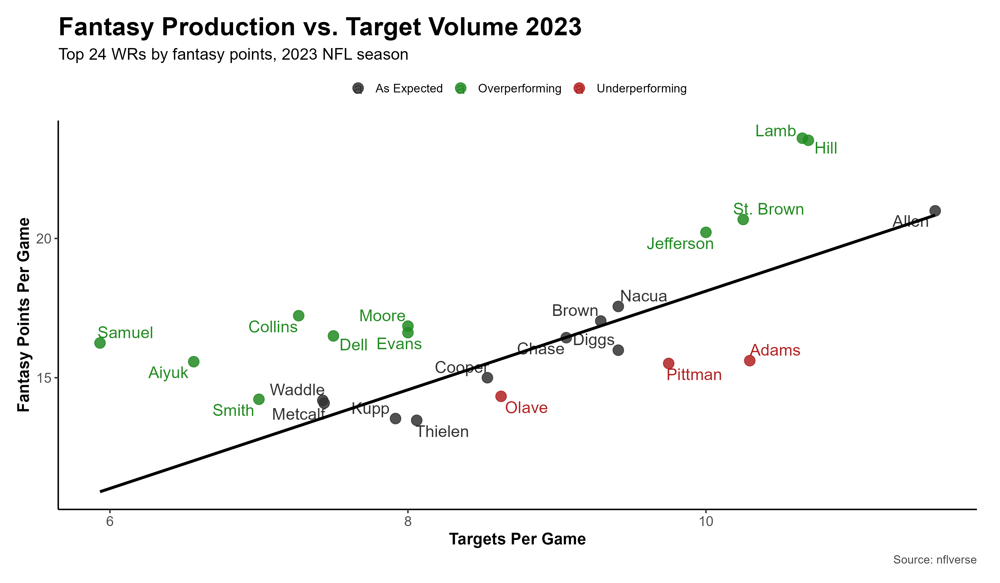
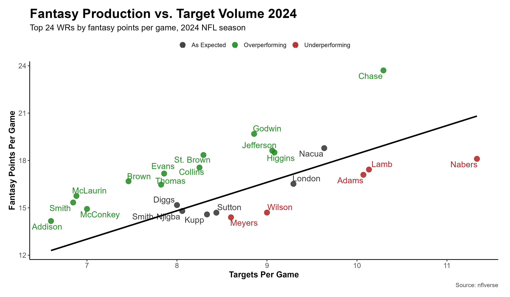
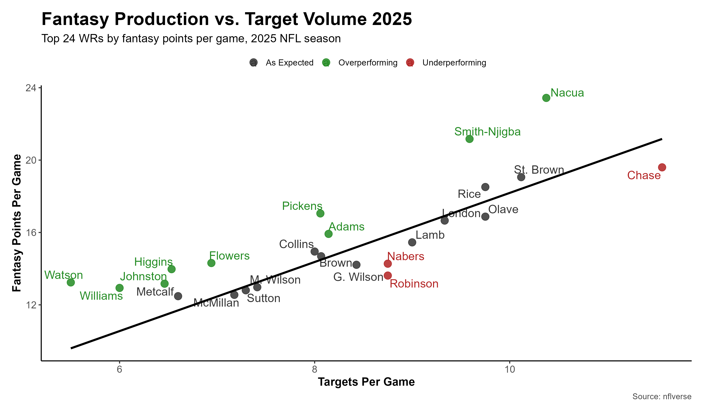

# widereceiver-fantasy
An exploration of fantasy football wide receivers in the past three seasons, and how their share of targets impact their production.

## Introduction

When it comes to wide receivers in fantasy football, one thing we know is important is volume. The amount of targets a player earns on a per-game basis explains a large percentage of the variance in fantasy points per game (R² value of 0.881 for 2025). However, volume alone does not determine fantasy success. This project takes a look at the receivers that are more (or less) efficient with their target share, and theorizes the reason for the discrepancy. I will be looking at receiving data collected from the last three regular seasons using the nflverse package on R. For each season, I fit a linear model relating targets to fantasy points per game for all qualifying NFL wide receivers. I used this model to then plot the top 24 players from each season in terms of fantasy points per game, where players over the line are outperforming based on targets and players below are underperforming.

## Model Performance

| Season | R² |
|---------|------|
| 2023 | 0.851 |
| 2024 | 0.847 |
| 2025 | 0.881 |

## Results

## Opportunity vs Offensive Efficiency

Taking a look at the graph from 2025, we see two red dots close to each other, indicating significant underperformance from both New York Giants receivers, Malik Nabers and Wan'Dale Robinson. Notably, Nabers only played four games last season, and Robinson's fantasy breakout came after Nabers went down. However, in the 2024 season, we can see Nabers once again positioned significantly under the line. One possible explanation for this is the Giants' inconsistent quarterback play and overall offensive performance in the past two seasons. A wide receiver's target efficiency can be hurt by an underperforming offense. On the contrary, both Rams' wide receivers, Puka Nacua and Davante Adams, are comfortably above the line, indication overperformance based on target quantity.

## The Importance of Target Quality

The concept of target quality is further emphasized when studying one of the top wide receivers in the league, Justin Jefferson. In 2024, the Vikings receiver had one of the best seasons of his career, finishing 4th in fantasy points per game. That season, the Vikings went 14-3, had surprisingly spectacular quarterback play from Sam Darnold, and finished 12th in the league in yards as an offense. On the 2024 graph, we can see Justin Jefferson is performing above expected. Compare it to last season, when the Vikings quarterback play was historically poor, and their offense finished 28th of 32. Justin Jefferson finished 31st in fantasy points per game, scoring 2.9 points less than expected, 3rd worst in the league. He'd be a glaring red dot outlier on the 2025 graph. Going back to 2023, when the QB play was still inconsistent, but much better than in 2025, Jefferson is in the green and near the top of the league. This may indicate the importance of quarterback play for a receiver's target efficiency. There are more occurrences of this, including Ceedee Lamb in 2023 vs 2024, Jaxon Smith-Njigba in 2024 vs 2025, and Ja'Marr Chase in 2024 vs 2025.

## Implications of Future Performance

Where a player can really stand out, in my opinion, is when they can perform above the line despite an inconsistent offense or quarterback play. Justin Jefferson in 2023 is an example of this. In 2025, Tee Higgins, Zay Flowers, Terry McLaurin and Jaylen Waddle all performed over expected despite questionable quarterback play. These players should enjoy improved target quality next season, possibly implying fantasy success. 

